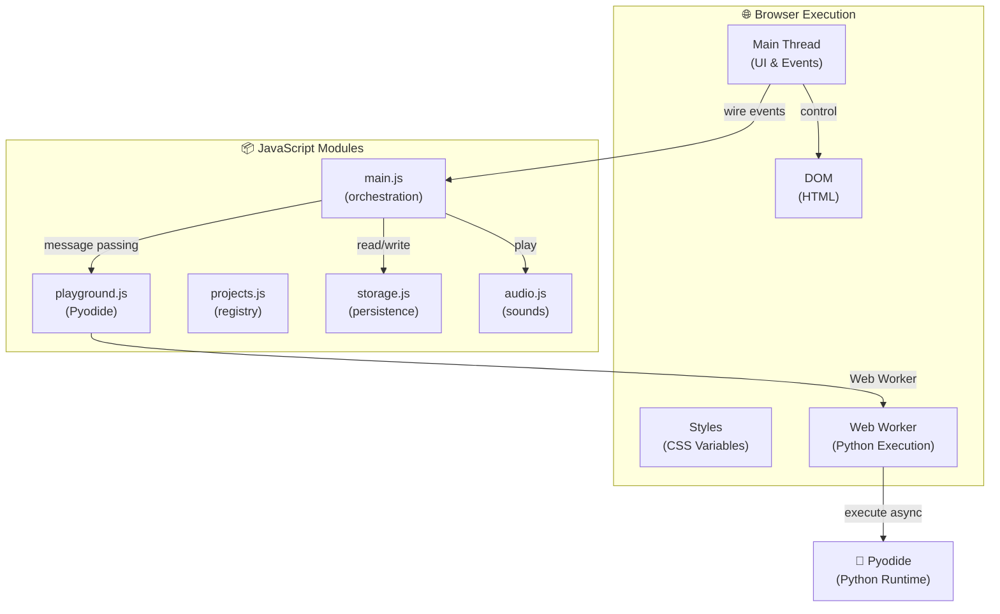
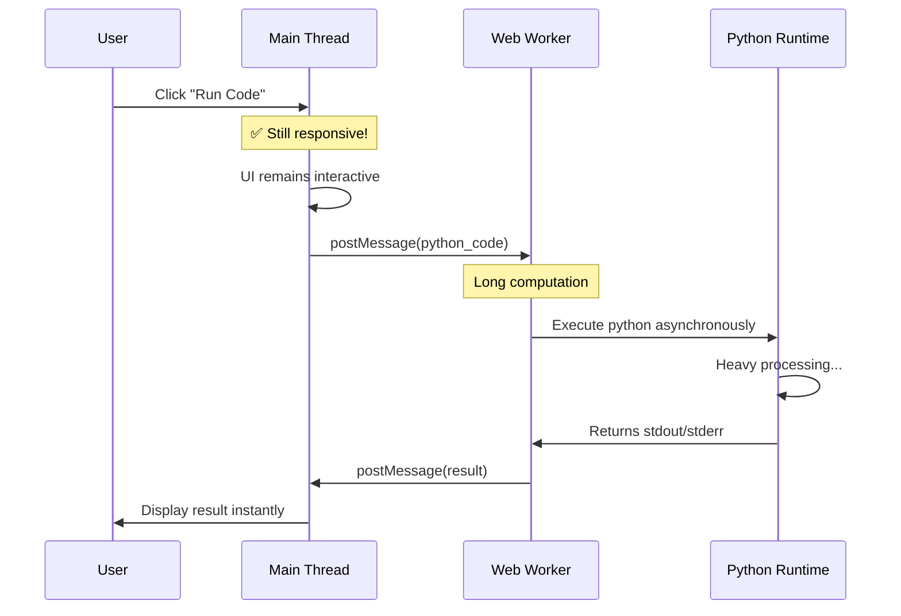
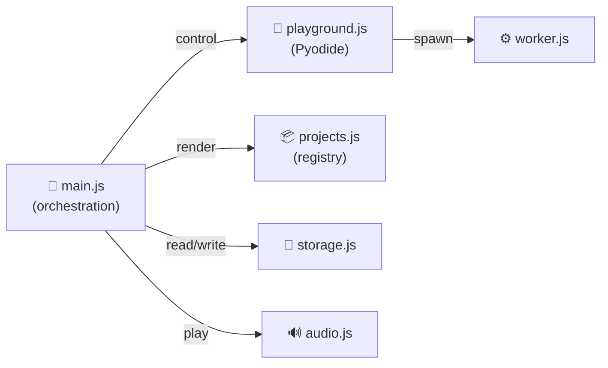

# 🚀 Web App Architecture Guide

<div align="center">


</div>

> **Python Mini Projects** — Interactive Frontend Documentation  
> A modern, accessible web experience powered by vanilla JavaScript, Pyodide, and Web Workers.

```
════════════════════════════════════════════════════════════════
                   🎨 Welcome to the Guide                         
        Architecture | Components | Design | Accessibility    
════════════════════════════════════════════════════════════════
```


## 📑 Quick Navigation

| Section | Purpose | Time |
|---------|---------|------|
| 🎯 [Architecture](#-system-architecture) | Core system design | 5 min |
| 🎨 [Components](#-component-library) | UI component reference | 8 min |
| 🎭 [Design System](#-design-system) | Colors, typography, animations | 6 min |
| ♿ [Accessibility](#-accessibility-standards) | WCAG 2.1 AA compliance | 7 min |
| 📱 [Responsive Design](#-responsive-design) | Mobile-first approach | 5 min |
| 👨‍💻 [Contributing](#-contributor-guide) | Setup & workflow | 10 min |
| ✨ [Adding Features](#-adding-new-projects) | Step-by-step guides | 10 min |

---

## 🎯 System Architecture

### High-Level Overview



### Project Philosophy

**Core Principles:**

1. **Zero Installation** — Run in browsers without Python install
2. **Progressive Enhancement** — Works with minimal JS, scales up
3. **Accessibility First** — WCAG 2.1 Level AA built-in
4. **Mobile-First** — Designed for mobile, scales to desktop
5. **Modular Architecture** — Independent, testable modules
6. **Performance** — Non-blocking execution, optimized rendering

### Thread Model: Why Web Workers? 🧵

Python code execution happens on a **separate thread** to prevent UI freezing:



**Benefits:**
- ✅ UI never freezes during computation
- ✅ Users can interact while code runs
- ✅ Click events process instantly
- ✅ Multiple computations can queue

### Infinite Loop Protection ⚡

The critical challenge: **How to stop an infinite loop?**

**Solution: Worker Termination**

```javascript
// When user clicks "Stop"
function stopExecution() {
    if (worker) {
        worker.terminate();  // ← Instantly kills the thread
        worker = null;
        spawnWorker();       // ← Create fresh worker
    }
}
```

**Why this works:**
- `terminate()` immediately halts the worker thread
- Even mid-infinite-loop, execution stops instantly
- No timeout hacks needed
- Fresh worker loads in ~100ms from cache

---

## 🎨 Component Library

### 🔘 Button Component

**Purpose:** Trigger actions — submit forms, launch projects, toggle features

```html
<!-- Primary button (call-to-action) -->
<button class="btn btn-primary">Play Game</button>

<!-- Secondary button -->
<button class="btn btn-secondary">Learn More</button>

<!-- Icon-only button -->
<button class="btn btn-icon" aria-label="Toggle theme">
    <i class="fas fa-sun"></i>
</button>

<!-- Disabled state -->
<button class="btn btn-primary" disabled>Loading...</button>
```

**CSS Structure:**

```css
.btn {
    padding: 0.75rem 1.5rem;
    border: none;
    border-radius: 0.5rem;
    font-weight: 600;
    cursor: pointer;
    transition: var(--transition);
    display: inline-flex;
    align-items: center;
    gap: 0.5rem;
}

.btn-primary {
    background-color: var(--primary-color);
    color: var(--on-accent);
}

.btn-primary:hover {
    filter: brightness(1.1);
    box-shadow: var(--shadow);
}

.btn:focus {
    outline: 2px solid var(--primary-color);
    outline-offset: 2px;
}

.btn:active {
    transform: scale(0.98);
}

.btn:disabled {
    opacity: 0.5;
    cursor: not-allowed;
}
```

**Variants:**
| Variant | Usage |
|---------|-------|
| `btn-primary` | Main CTA, important actions |
| `btn-secondary` | Alternative actions |
| `btn-danger` | Destructive actions |
| `btn-icon` | Icon-only (must have aria-label) |

**Accessibility:**
- ✅ Keyboard focusable (Tab key)
- ✅ Enter/Space activates
- ✅ Focus indicator visible
- ✅ Minimum 44×44px hit target
- ✅ Screen reader friendly

---

### 🃏 Card Component

**Purpose:** Display project information in scannable units

```html
<article class="project-card" aria-label="Rock Paper Scissors game">
    <div class="card-header">
        <h3 class="card-title">🎮 Rock Paper Scissors</h3>
        <span class="badge badge-game">Game</span>
    </div>
    
    <p class="card-description">
        Classic strategy game with AI opponent. Master the mind games!
    </p>
    
    <div class="card-metadata">
        <span class="badge badge-difficulty">Beginner</span>
        <span class="stat">⏱️ 5 min</span>
    </div>
    
    <button class="btn btn-primary" data-project="rock-paper-scissor">
        Play Now
    </button>
</article>
```

**CSS:**

```css
.project-card {
    background: var(--surface-color);
    border: 1px solid var(--border-color);
    border-radius: 0.75rem;
    padding: 1.5rem;
    transition: var(--transition);
    cursor: pointer;
    display: flex;
    flex-direction: column;
    gap: 1rem;
}

.project-card:hover {
    transform: translateY(-4px);
    box-shadow: var(--shadow);
    border-color: var(--primary-color);
}

.project-card:focus-within {
    outline: 2px solid var(--primary-color);
    outline-offset: 2px;
}

.card-title {
    font-size: 1.25rem;
    margin: 0;
    color: var(--text-color);
}

.card-description {
    color: var(--text-secondary);
    margin: 0;
    line-height: 1.5;
}

.badge {
    display: inline-block;
    padding: 0.25rem 0.75rem;
    border-radius: 9999px;
    font-size: 0.85rem;
    font-weight: 600;
    background: var(--accent-soft);
    color: var(--primary-color);
    border: 1px solid var(--accent-border);
}
```

**Grid Responsive:**

```css
.projects-grid {
    display: grid;
    grid-template-columns: 1fr;
    gap: 1rem;
}

@media (min-width: 640px) {
    .projects-grid {
        grid-template-columns: repeat(2, 1fr);
        gap: 1.5rem;
    }
}

@media (min-width: 1024px) {
    .projects-grid {
        grid-template-columns: repeat(auto-fill, minmax(280px, 1fr));
        gap: 2rem;
    }
}
```

---

### 🪟 Modal Component

**Purpose:** Display project UIs in focused overlay without navigation

```html
<div class="modal" id="projectModal" role="dialog" aria-modal="true" hidden>
    <div class="modal-overlay" id="modalOverlay"></div>
    <div class="modal-dialog">
        <div class="modal-header">
            <h2 class="modal-title" id="modalTitle">🎮 Project Name</h2>
            <button class="modal-close" id="modalClose" aria-label="Close dialog">×</button>
        </div>
        <div class="modal-body" id="modalBody"></div>
    </div>
</div>

<main id="main-content" inert><!-- Page content --></main>
```

**CSS:**

```css
.modal {
    position: fixed;
    inset: 0;
    z-index: 2000;
    display: flex;
    align-items: center;
    justify-content: center;
    padding: 1rem;
    animation: fadeIn 0.3s ease;
}

.modal[hidden] { display: none; }

.modal-overlay {
    position: absolute;
    inset: 0;
    background: var(--overlay-color);
    cursor: pointer;
}

.modal-dialog {
    position: relative;
    z-index: 1;
    background: var(--surface-color);
    border-radius: 0.75rem;
    max-width: 90vw;
    max-height: 90vh;
    overflow: hidden;
    display: flex;
    flex-direction: column;
    box-shadow: var(--shadow-modal);
    animation: slideUp 0.3s ease;
}

.modal-header {
    display: flex;
    justify-content: space-between;
    align-items: center;
    padding: 1.5rem;
    border-bottom: 1px solid var(--border-color);
}

.modal-close:focus {
    outline: 2px solid var(--primary-color);
    border-radius: 0.25rem;
}

.modal-body {
    padding: 1.5rem;
    overflow-y: auto;
    flex: 1;
}

@keyframes fadeIn {
    from { opacity: 0; }
    to { opacity: 1; }
}

@keyframes slideUp {
    from {
        transform: translateY(20px);
        opacity: 0;
    }
    to {
        transform: translateY(0);
        opacity: 1;
    }
}
```

**Focus Management (JavaScript):**

```javascript
function openProjectModal(projectName) {
    const html = getProjectHTML(projectName);
    modalBody.innerHTML = html;
    modal.removeAttribute('hidden');
    mainContent.setAttribute('inert', '');
    modalClose.focus();
}

function closeProjectModal() {
    modal.setAttribute('hidden', '');
    mainContent.removeAttribute('inert');
    triggerButton.focus();
}

document.addEventListener('keydown', (e) => {
    if (e.key === 'Escape' && !modal.hasAttribute('hidden')) {
        closeProjectModal();
    }
});

document.getElementById('modalOverlay').addEventListener('click', closeProjectModal);
modalClose.addEventListener('click', closeProjectModal);
```

---

### 🔍 Search Component

**Purpose:** Enable users to quickly find projects by name or keyword

```html
<div class="search-wrapper">
    <input type="search" id="projectSearch" 
           placeholder="Search projects... (/ to focus)"
           aria-label="Search projects" />
    <button id="searchClear" aria-label="Clear search">×</button>
    <div id="searchLoader" hidden>
        <i class="fas fa-spinner fa-spin"></i>
    </div>
    <div id="searchDropdown" hidden>
        <div id="recentSearchesSection">
            <div class="search-section-title">Recent</div>
            <ul id="recentSearchesList"></ul>
        </div>
        <div id="resultsSection">
            <ul id="resultsList"></ul>
        </div>
    </div>
</div>
```

**Features:**
- Keyboard shortcut `/` to focus
- Debounced 300ms for performance
- Recent searches saved to localStorage
- Dropdown with suggestions
- Escape key closes dropdown

---

### 🐍 Python Playground

**Purpose:** Interactive code editor and executor powered by Pyodide

```html
<div class="playground-section" id="playgroundSection" hidden>
    <div class="playground-header">
        <h1 class="playground-title">🐍 Python Playground</h1>
        <span class="playground-status" id="playgroundStatus">Initializing...</span>
        <p class="playground-hint">Press <kbd>Ctrl+Enter</kbd> to run</p>
    </div>
    
    <div class="playground-container">
        <div class="playground-editor-section">
            <label for="codeEditor">Code Editor</label>
            <textarea id="codeEditor" class="code-editor" 
                      placeholder="Enter Python code here..."></textarea>
        </div>
        
        <div class="playground-output-section">
            <label for="outputPane">Output</label>
            <pre id="outputPane" class="output-pane"></pre>
        </div>
    </div>
    
    <div class="playground-controls">
        <button id="runCode" class="btn btn-primary">▶ Run</button>
        <button id="stopCode" class="btn btn-danger" disabled>⏹ Stop</button>
        <button id="resetCode" class="btn btn-secondary">↺ Reset</button>
    </div>
</div>
```

**Keyboard Shortcuts:**
| Shortcut | Action |
|----------|--------|
| `Ctrl+Enter` | Run code |
| `Tab` | Insert tab |

---

### 🎨 Theme Toggle

**Purpose:** Allow users to switch between dark and light themes

```javascript
function toggleTheme() {
    const html = document.documentElement;
    const currentTheme = html.getAttribute('data-theme') || 'dark';
    const newTheme = currentTheme === 'dark' ? 'light' : 'dark';
    
    html.setAttribute('data-theme', newTheme);
    const icon = document.getElementById('themeIcon');
    icon.className = newTheme === 'dark' ? 'fas fa-moon' : 'fas fa-sun';
    localStorage.setItem('theme', newTheme);
}

function initTheme() {
    const saved = localStorage.getItem('theme');
    if (saved) {
        applyTheme(saved);
    } else if (window.matchMedia('(prefers-color-scheme: light)').matches) {
        applyTheme('light');
    } else {
        applyTheme('dark');
    }
}

initTheme();
document.getElementById('themeToggle').addEventListener('click', toggleTheme);
```

---

## 🎭 Design System

### 🌈 Color Palette

#### Dark Theme (Default)
```css
--primary-color: #22c55e        /* Brand green */
--secondary-color: #06b6d4      /* Cyan accent */
--success-color: #10b981        /* Green success */
--danger-color: #ef4444         /* Red errors */
--warning-color: #f59e0b        /* Orange warnings */

--bg-color: #081120             /* Deep blue background */
--surface-color: #111827        /* Dark surface */
--panel-color: #0f172a          /* Input/nested bg */
--text-color: #e5e7eb           /* Light text */
--text-secondary: #94a3b8       /* Muted text */
--border-color: #1f2937         /* Subtle borders */
```

#### Light Theme
```css
--primary-color: #16a34a        /* Darker green */
--bg-color: #f8fafc             /* Light background */
--surface-color: #ffffff        /* White surfaces */
--text-color: #1f2937           /* Dark text */
--text-secondary: #6b7280       /* Muted text */
--border-color: #d8dee8         /* Light borders */
```

### 📝 Typography

**Font Stack:**
```css
/* Headings */
font-family: 'Fredoka', 'Segoe UI', sans-serif;

/* Body */
font-family: 'DM Sans', 'Segoe UI', sans-serif;

/* Code */
font-family: 'IBM Plex Mono', monospace;
```

**Responsive Font Sizes:**
```css
h1 { font-size: clamp(1.75rem, 5vw, 3rem); }
h2 { font-size: clamp(1.5rem, 4vw, 2.25rem); }
h3 { font-size: clamp(1.25rem, 3vw, 1.875rem); }

body {
    font-size: clamp(0.95rem, 2vw, 1.1rem);
    line-height: 1.6;
}
```

---

### ✨ Animation & Motion

**Standard Animations:**

```css
/* Fade in entrance */
@keyframes fadeIn {
    from { opacity: 0; }
    to { opacity: 1; }
}

/* Slide up entrance */
@keyframes slideUp {
    from {
        transform: translateY(20px);
        opacity: 0;
    }
    to {
        transform: translateY(0);
        opacity: 1;
    }
}

/* Pulse (loading indicator) */
@keyframes pulse {
    0%, 100% { opacity: 1; }
    50% { opacity: 0.7; }
}

/* Spin (loading spinner) */
@keyframes spin {
    from { transform: rotate(0deg); }
    to { transform: rotate(360deg); }
}

/* Bounce (attention) */
@keyframes bounce {
    0%, 100% { transform: translateY(0); }
    50% { transform: translateY(-10px); }
}

/* Glow effect */
@keyframes glow {
    0%, 100% { box-shadow: 0 0 5px var(--primary-color); }
    50% { box-shadow: 0 0 20px var(--primary-color); }
}

/* Shimmer loading effect */
@keyframes shimmer {
    0% { background-position: -1000px 0; }
    100% { background-position: 1000px 0; }
}
```

**Transition Timing:**
```css
--transition: all 0.3s cubic-bezier(0.4, 0, 0.2, 1);
--transition-fast: 0.15s cubic-bezier(0.4, 0, 0.2, 1);
--motion-duration: 0.3s;
```

**Reduced Motion Support:**
```css
@media (prefers-reduced-motion: reduce) {
    *,
    *::before,
    *::after {
        animation-duration: 0.01ms !important;
        animation-iteration-count: 1 !important;
        transition-duration: 0.01ms !important;
    }
}
```

---

## ♿ Accessibility Standards

### WCAG 2.1 Level AA Compliance

| Criterion | Implementation |
|-----------|-----------------|
| **Semantic HTML** | `<button>`, `<nav>`, `<main>`, `<article>` |
| **Keyboard Navigation** | Tab, Enter, Escape, Arrow keys functional |
| **Focus Indicators** | 2px outline ring at 2px offset |
| **Color Contrast** | 4.5:1 text, 3:1 large text |
| **Screen Readers** | ARIA labels, landmarks, live regions |
| **Reduced Motion** | Animations disabled when requested |
| **Alt Text** | Provided for meaningful images |
| **Form Labels** | Associated with inputs via `<label>` |

### ⌨️ Keyboard Navigation

**Focusable Elements:**
- `<button>` and `<a href>`
- `<input>`, `<textarea>`, `<select>`
- Elements with `tabindex="0"`

**Keyboard Shortcuts:**
| Key | Action |
|-----|--------|
| `Tab` | Move to next element |
| `Shift+Tab` | Move to previous element |
| `Enter` | Activate button, submit form |
| `Space` | Toggle checkbox |
| `/` | Focus search input |
| `Escape` | Close modal, menu |
| `Arrow Keys` | Navigate menu/list |

### 🏷️ ARIA Essentials

```html
<!-- Icon-only buttons need labels -->
<button aria-label="Close dialog">×</button>

<!-- Dialog needs these -->
<div role="dialog" aria-modal="true" aria-labelledby="title">
    <h2 id="title">Modal Title</h2>
</div>

<!-- Dynamic content announcement -->
<div aria-live="polite" aria-atomic="true">
    Form validation message
</div>

<!-- Decorative icons hidden -->
<i class="fas fa-star" aria-hidden="true"></i>

<!-- Input descriptions -->
<input id="email" aria-describedby="emailHelp" />
<span id="emailHelp">Enter your email</span>

<!-- Tabs component -->
<div role="tablist">
    <button role="tab" aria-selected="true">Tab 1</button>
</div>
```

### ♿ Accessibility Checklist

```markdown
☐ Semantic HTML used correctly
☐ All interactive elements keyboard accessible
☐ Focus indicators visible
☐ Color contrast meets 4.5:1 (WCAG AA)
☐ Form inputs have labels
☐ Images have alt text
☐ Modals trap focus
☐ Screen reader tested
☐ Keyboard-only navigation works
☐ No keyboard traps
☐ Error messages associated with inputs
☐ Reduced motion respected
☐ Touch targets 44×44px+
```

---

## 📱 Responsive Design System

### 📊 Breakpoints & Strategy

**Mobile-First Approach:**
```css
/* Base: Mobile (320px+) */
.element { padding: 1rem; font-size: 1rem; }

/* Small devices (640px+) */
@media (min-width: 640px) {
    .element { padding: 1.5rem; }
}

/* Tablets (768px+) */
@media (min-width: 768px) {
    .element { padding: 2rem; }
}

/* Desktop (1024px+) */
@media (min-width: 1024px) {
    .element { padding: 2.5rem; max-width: 1200px; }
}

/* Large screens (1440px+) */
@media (min-width: 1440px) {
    .element { padding: 3rem; }
}
```

### Grid Behavior

```css
/* Mobile: single column */
.grid {
    display: grid;
    grid-template-columns: 1fr;
    gap: 1rem;
}

/* Tablet: 2 columns */
@media (min-width: 640px) {
    .grid {
        grid-template-columns: repeat(2, 1fr);
        gap: 1.5rem;
    }
}

/* Desktop: auto-fill */
@media (min-width: 1024px) {
    .grid {
        grid-template-columns: repeat(auto-fill, minmax(280px, 1fr));
        gap: 2rem;
    }
}
```

### 💧 Fluid Typography

```css
/* Scales between breakpoints */
h1 { font-size: clamp(1.75rem, 5vw, 3rem); }
h2 { font-size: clamp(1.5rem, 4vw, 2.25rem); }
body { font-size: clamp(0.95rem, 2vw, 1.1rem); }
```

### 🖱️ Touch-Friendly Design

```css
/* Minimum 44×44px touch targets */
.btn {
    min-width: 44px;
    min-height: 44px;
    padding: 0.75rem 1rem;
}

/* Remove 300ms click delay */
a, button, input {
    touch-action: manipulation;
}
```

---

## 📂 Folder Structure

```
web-app/
├── 📄 index.html              # Homepage
├── 📄 games.html              # Games category
├── 📄 math.html               # Math category
├── 📄 utilities.html          # Utilities category
│
├── 📁 css/
│   └── 📄 styles.css          # All styles
│
├── 📁 js/
│   ├── 📄 main.js             # Orchestration
│   ├── 📄 playground.js       # Pyodide interface
│   ├── 📄 playground-worker.js # Web Worker
│   ├── 📄 projects.js         # Project registry
│   ├── 📄 audio.js            # Sound effects
│   ├── 📄 storage.js          # localStorage
│   └── 📁 projects/           # 40+ project files
│
└── 📁 assets/
    ├── favicon.svg
    ├── logo.png
    └── images/
```

---

## 📊 JavaScript Modules

### Module Relationships



### Module Responsibilities

| Module | Responsibility | Key Functions |
|--------|-----------------|-----------------|
| **main.js** | App orchestration, DOM events | toggleTheme(), openModal(), filterProjects() |
| **playground.js** | Pyodide interface, Worker lifecycle | initPlayground(), runCode(), stopExecution() |
| **playground-worker.js** | Python execution | loadPyodide(), execute code, capture output |
| **projects.js** | Project registry | getProjectHTML(), initialize projects |
| **storage.js** | localStorage wrapper | saveToStorage(), loadFromStorage() |
| **audio.js** | Sound effects | play(), toggleMute() |

---

## 👨‍💻 Contributor Guide

### 🚀 Quick Start

```bash
# Clone repo
git clone https://github.com/steam-bell-92/python-mini-project.git
cd python-mini-project/web-app

# Serve locally
python -m http.server 8000

# Open browser: http://localhost:8000
# Open DevTools: F12 or Ctrl+Shift+I
```

### 🔧 Development Workflow

```bash
# Create feature branch
git checkout -b feature/your-feature-name

# Make changes, test thoroughly

# Test checklist:
# - Keyboard navigation (Tab, Enter, Escape)
# - Focus indicators visible
# - Mobile responsive (320px, 768px, 1024px)
# - Dark and light themes
# - No console errors
# - No a11y violations

# Commit
git add web-app/
git commit -m "feat: your message"
git push origin feature/your-feature-name
```

### ✅ PR Review Checklist

```markdown
## Code Quality
☐ Semantic HTML used
☐ CSS uses variables
☐ No hardcoded colors
☐ No console errors

## Functionality
☐ All features work
☐ Modals open/close
☐ Theme toggle works
☐ Search functions

## Accessibility
☐ Keyboard nav works
☐ Focus visible
☐ Color contrast OK
☐ Screen reader OK

## Responsive
☐ Mobile (320px)
☐ Tablet (768px)
☐ Desktop (1024px)
☐ Touch targets 44×44px

## Themes
☐ Dark mode works
☐ Light mode works
☐ Transitions smooth
```

---

## ✨ Adding New Projects

### Step 1: Create Project File

Create `web-app/js/projects/your-project.js`:

```javascript
function getYourProjectNameHTML() {
    return `
        <div class="project-content">
            <h2>🎮 Your Project</h2>
            <div id="gameBoard"></div>
            <div class="controls">
                <button class="btn btn-primary" id="startBtn">Start</button>
                <button class="btn btn-secondary" id="resetBtn">Reset</button>
            </div>
            <p>Score: <span id="score">0</span></p>
        </div>
    `;
}

function initializeYourProjectName() {
    const startBtn = document.getElementById('startBtn');
    const resetBtn = document.getElementById('resetBtn');
    let score = 0;
    
    startBtn.addEventListener('click', () => {
        // Start game
        score++;
        document.getElementById('score').textContent = score;
    });
    
    resetBtn.addEventListener('click', () => {
        score = 0;
        document.getElementById('score').textContent = score;
    });
}
```

### Step 2: Register in projects.js

```javascript
function getProjectHTML(projectName) {
    const projects = {
        'your-project': () => getYourProjectNameHTML(),
        // ... others ...
    };
    return projects[projectName]?.() || '<h2>Coming Soon</h2>';
}
```

### Step 3: Add to HTML

```html
<!-- games.html or math.html -->

<article class="project-card" data-project="your-project">
    <h3 class="card-title">🎮 Your Project</h3>
    <p class="card-description">Brief description</p>
    <div class="card-metadata">
        <span class="badge badge-game">Game</span>
        <span class="stat">⏱️ 5 min</span>
    </div>
    <button class="btn btn-primary">Play Now</button>
</article>
```

### Step 4: Test

```markdown
✓ Modal opens
✓ UI renders
✓ Keyboard nav works
✓ Mobile responsive
✓ Themes work
✓ No console errors
```

---

## 🎨 Adding New Components

### Component Template

```html
<div class="component" role="region" aria-label="Description">
    <h3 class="component-title">Title</h3>
    <p class="component-content">Content</p>
</div>
```

```css
.component {
    background: var(--surface-color);
    border: 1px solid var(--border-color);
    border-radius: 0.5rem;
    padding: 1.5rem;
    transition: var(--transition);
}

.component:hover {
    border-color: var(--primary-color);
    box-shadow: var(--shadow);
}

.component:focus-within {
    outline: 2px solid var(--primary-color);
    outline-offset: 2px;
}

@media (max-width: 640px) {
    .component { padding: 1rem; }
}
```

### Component Requirements

- ✅ Semantic HTML
- ✅ CSS variables only
- ✅ Keyboard accessible
- ✅ Focus visible
- ✅ Mobile responsive
- ✅ Theme compatible
- ✅ Screen reader friendly

---

## ⚙️ Storage & Persistence API

```javascript
// storage.js utilities

function saveToStorage(key, value) {
    try {
        localStorage.setItem(key, JSON.stringify(value));
        return true;
    } catch (error) {
        console.error('Storage error:', error);
        return false;
    }
}

function loadFromStorage(key, defaultValue = null) {
    try {
        const data = localStorage.getItem(key);
        return data ? JSON.parse(data) : defaultValue;
    } catch (error) {
        return defaultValue;
    }
}

function removeFromStorage(key) {
    localStorage.removeItem(key);
}
```

---

## 🧪 Testing & Debugging

### Manual Testing Checklist

```markdown
## Functionality
✓ Buttons work
✓ Forms submit
✓ Modals open/close
✓ Search filters
✓ Theme toggles

## Keyboard Navigation
✓ Tab navigation works
✓ Shift+Tab works
✓ Enter activates
✓ Escape closes
✓ / focuses search

## Responsive
✓ Mobile (320px)
✓ Tablet (768px)
✓ Desktop (1024px)
✓ No horizontal scroll
✓ Touch targets adequate

## Accessibility
✓ Focus visible
✓ Color contrast OK
✓ Form labels present
✓ ARIA attributes OK
✓ Screen reader OK

## Cross-Browser
✓ Chrome
✓ Firefox
✓ Safari
✓ Edge
✓ Mobile browsers
```

### DevTools Tips

```
F12 / Ctrl+Shift+I → Open DevTools
  • Elements → HTML structure
  • Console → JavaScript errors
  • Sources → Set breakpoints
  • Network → Resource loading
  • Performance → Animation profile
```

---

## 📈 Performance Optimization

| Technique | Benefit |
|-----------|---------|
| **Debounce** | Reduce function calls (search 300ms) |
| **Cache DOM** | Fewer queries |
| **Event delegation** | Fewer listeners |
| **Lazy load** | Faster initial load |
| **CSS animations** | 60fps performance |
| **Web Workers** | Non-blocking UI |

---

## 🔗 CSS Variables Reference

```css
:root {
    /* Brand Colors */
    --primary-color: #22c55e;
    --secondary-color: #06b6d4;
    
    /* Semantic */
    --success-color: #10b981;
    --danger-color: #ef4444;
    --warning-color: #f59e0b;
    
    /* Backgrounds */
    --bg-color: #081120;
    --surface-color: #111827;
    --panel-color: #0f172a;
    
    /* Text */
    --text-color: #e5e7eb;
    --text-secondary: #94a3b8;
    
    /* Borders */
    --border-color: #1f2937;
    
    /* Effects */
    --shadow: 0 10px 30px rgba(0, 0, 0, 0.3);
    --shadow-modal: 0 25px 50px -12px rgba(0, 0, 0, 0.45);
    
    /* Timing */
    --transition: all 0.3s cubic-bezier(0.4, 0, 0.2, 1);
    --transition-fast: 0.15s cubic-bezier(0.4, 0, 0.2, 1);
}
```

---

## 🚀 Performance Stats

| Operation | Time |
|-----------|------|
| First Pyodide load | 3–5s |
| Cached Pyodide | 100–300ms |
| Modal animation | 300ms |
| Theme transition | 300ms |
| Search debounce | 300ms |

---

## � Form Components & Validation

### Input Field

```html
<div class="form-group">
    <label for="username" class="form-label">Username</label>
    <input type="text" id="username" 
           class="form-input"
           placeholder="Enter username"
           aria-describedby="usernameHelp"
           required />
    <span id="usernameHelp" class="form-help">
        2-20 characters, letters and numbers only
    </span>
    <span id="usernameError" class="form-error" role="alert" hidden></span>
</div>
```

```css
.form-group {
    display: flex;
    flex-direction: column;
    gap: 0.5rem;
    margin-bottom: 1.5rem;
}

.form-label {
    font-weight: 600;
    color: var(--text-color);
    font-size: 0.95rem;
}

.form-input {
    padding: 0.75rem;
    border: 1px solid var(--border-color);
    border-radius: 0.5rem;
    background: var(--panel-color);
    color: var(--text-color);
    font: inherit;
    transition: var(--transition);
}

.form-input:focus {
    outline: none;
    border-color: var(--primary-color);
    box-shadow: 0 0 0 2px var(--primary-color);
    opacity: 0.2;
}

.form-input:invalid:not(:placeholder-shown) {
    border-color: var(--danger-color);
}

.form-help {
    font-size: 0.85rem;
    color: var(--text-secondary);
}

.form-error {
    font-size: 0.85rem;
    color: var(--danger-color);
    animation: slideDown 0.3s ease;
}

@keyframes slideDown {
    from {
        opacity: 0;
        transform: translateY(-8px);
    }
    to {
        opacity: 1;
        transform: translateY(0);
    }
}
```

### Form Validation (JavaScript)

```javascript
function validateForm() {
    const username = document.getElementById('username');
    const usernameError = document.getElementById('usernameError');
    const isValid = /^[a-zA-Z0-9]{2,20}$/.test(username.value);
    
    if (!isValid) {
        usernameError.textContent = 'Username invalid';
        usernameError.removeAttribute('hidden');
        username.setAttribute('aria-invalid', 'true');
        username.setAttribute('aria-describedby', 'usernameError');
    } else {
        usernameError.setAttribute('hidden', '');
        username.removeAttribute('aria-invalid');
    }
    
    return isValid;
}

document.getElementById('username').addEventListener('blur', validateForm);
```

---

## 📊 Data Visualization & Tables

### Responsive Table

```html
<div class="table-wrapper">
    <table class="data-table" role="table">
        <thead>
            <tr>
                <th scope="col">Project</th>
                <th scope="col">Category</th>
                <th scope="col">Difficulty</th>
                <th scope="col">Time</th>
                <th scope="col">Players</th>
            </tr>
        </thead>
        <tbody>
            <tr>
                <td data-label="Project">🎮 Snake Game</td>
                <td data-label="Category">Game</td>
                <td data-label="Difficulty">Easy</td>
                <td data-label="Time">10 min</td>
                <td data-label="Players">1</td>
            </tr>
        </tbody>
    </table>
</div>
```

```css
.table-wrapper {
    overflow-x: auto;
    border-radius: 0.5rem;
    border: 1px solid var(--border-color);
}

.data-table {
    width: 100%;
    border-collapse: collapse;
    font-size: 0.95rem;
}

.data-table thead {
    background: var(--surface-color);
}

.data-table th {
    padding: 1rem;
    text-align: left;
    font-weight: 600;
    color: var(--text-color);
    border-bottom: 2px solid var(--border-color);
}

.data-table td {
    padding: 1rem;
    border-bottom: 1px solid var(--border-color);
    color: var(--text-color);
}

.data-table tr:hover {
    background: var(--panel-color);
}

/* Mobile: Show as cards */
@media (max-width: 768px) {
    .data-table thead { display: none; }
    
    .data-table tr {
        display: block;
        margin-bottom: 1.5rem;
        border: 1px solid var(--border-color);
        border-radius: 0.5rem;
        padding: 1rem;
    }
    
    .data-table td {
        display: block;
        padding: 0.5rem 0;
        border: none;
    }
    
    .data-table td::before {
        content: attr(data-label);
        font-weight: 600;
        display: block;
        margin-bottom: 0.25rem;
        color: var(--text-secondary);
    }
}
```

---

## 🔔 Notification & Toast System

```html
<div id="notificationContainer" class="notification-container" role="region" aria-live="polite">
    <!-- Toasts injected here -->
</div>
```

```javascript
const NotificationSystem = {
    show(message, type = 'info', duration = 3000) {
        const container = document.getElementById('notificationContainer');
        const toast = document.createElement('div');
        toast.className = `notification notification-${type} notification-enter`;
        toast.setAttribute('role', 'alert');
        toast.setAttribute('aria-atomic', 'true');
        
        const icon = {
            success: '✓',
            error: '✕',
            warning: '!',
            info: 'ℹ'
        }[type] || 'ℹ';
        
        toast.innerHTML = `
            <span class="notification-icon">${icon}</span>
            <span class="notification-message">${message}</span>
            <button class="notification-close" aria-label="Close">×</button>
        `;
        
        container.appendChild(toast);
        
        toast.querySelector('.notification-close').addEventListener('click', () => {
            toast.classList.replace('notification-enter', 'notification-exit');
            setTimeout(() => toast.remove(), 300);
        });
        
        if (duration > 0) {
            setTimeout(() => {
                toast.classList.replace('notification-enter', 'notification-exit');
                setTimeout(() => toast.remove(), 300);
            }, duration);
        }
        
        return toast;
    },
    
    success: (msg, duration) => NotificationSystem.show(msg, 'success', duration),
    error: (msg, duration) => NotificationSystem.show(msg, 'error', duration),
    warning: (msg, duration) => NotificationSystem.show(msg, 'warning', duration),
    info: (msg, duration) => NotificationSystem.show(msg, 'info', duration),
};

// Usage
NotificationSystem.success('Changes saved!');
NotificationSystem.error('An error occurred');
```

```css
.notification-container {
    position: fixed;
    top: 1rem;
    right: 1rem;
    z-index: 5000;
    display: flex;
    flex-direction: column;
    gap: 0.5rem;
}

.notification {
    display: flex;
    align-items: center;
    gap: 0.75rem;
    padding: 1rem;
    border-radius: 0.5rem;
    background: var(--surface-color);
    border-left: 4px solid;
    box-shadow: var(--shadow);
    font-weight: 500;
    animation: slideInRight 0.3s ease;
}

.notification-success { border-left-color: var(--success-color); }
.notification-error { border-left-color: var(--danger-color); }
.notification-warning { border-left-color: var(--warning-color); }
.notification-info { border-left-color: var(--secondary-color); }

.notification-enter {
    animation: slideInRight 0.3s ease;
}

.notification-exit {
    animation: slideOutRight 0.3s ease;
}

@keyframes slideInRight {
    from {
        transform: translateX(400px);
        opacity: 0;
    }
    to {
        transform: translateX(0);
        opacity: 1;
    }
}

@keyframes slideOutRight {
    from {
        transform: translateX(0);
        opacity: 1;
    }
    to {
        transform: translateX(400px);
        opacity: 0;
    }
}
```

---

## 🎯 Event Handling Patterns

### Debounce Utility

```javascript
function debounce(fn, delay = 300) {
    let timeoutId;
    return function(...args) {
        clearTimeout(timeoutId);
        timeoutId = setTimeout(() => {
            fn.apply(this, args);
        }, delay);
    };
}

// Usage: Debounced search
const handleSearchChange = debounce((query) => {
    filterProjects(query);
}, 300);

document.getElementById('search').addEventListener('input', (e) => {
    handleSearchChange(e.target.value);
});
```

### Throttle Utility

```javascript
function throttle(fn, delay = 300) {
    let lastTime = 0;
    return function(...args) {
        const now = Date.now();
        if (now - lastTime >= delay) {
            fn.apply(this, args);
            lastTime = now;
        }
    };
}

// Usage: Throttled scroll handler
const handleScroll = throttle(() => {
    updateScrollPosition();
}, 300);

window.addEventListener('scroll', handleScroll);
```

### Event Delegation

```javascript
// Single listener for all project cards
document.addEventListener('click', (e) => {
    const card = e.target.closest('.project-card');
    if (card) {
        const projectName = card.dataset.project;
        openProjectModal(projectName);
    }
});

// Advantages:
// - Single listener instead of multiple
// - Works for dynamically added elements
// - Better performance
// - Easier to manage
```

---

## 💾 Advanced Storage Patterns

### Structured Data Storage

```javascript
class ProjectStorage {
    static saveProgress(projectName, progress) {
        const data = {
            project: projectName,
            progress: progress,
            timestamp: Date.now(),
            version: 1
        };
        saveToStorage(`progress_${projectName}`, data);
    }
    
    static getProgress(projectName) {
        return loadFromStorage(`progress_${projectName}`, {
            progress: 0,
            timestamp: null
        });
    }
    
    static getAllProgress() {
        const keys = Object.keys(localStorage);
        return keys
            .filter(k => k.startsWith('progress_'))
            .map(k => loadFromStorage(k));
    }
    
    static clearProgress(projectName) {
        removeFromStorage(`progress_${projectName}`);
    }
}

// Usage
ProjectStorage.saveProgress('snake-game', 150);
const progress = ProjectStorage.getProgress('snake-game');
const allProgress = ProjectStorage.getAllProgress();
```

### Cache Pattern

```javascript
class CacheManager {
    constructor(maxAge = 3600000) { // 1 hour
        this.cache = new Map();
        this.maxAge = maxAge;
    }
    
    set(key, value) {
        this.cache.set(key, {
            value,
            timestamp: Date.now()
        });
    }
    
    get(key) {
        const entry = this.cache.get(key);
        if (!entry) return null;
        
        const age = Date.now() - entry.timestamp;
        if (age > this.maxAge) {
            this.cache.delete(key);
            return null;
        }
        
        return entry.value;
    }
    
    clear() {
        this.cache.clear();
    }
}

const cache = new CacheManager();
cache.set('projects', projectList);
const cached = cache.get('projects');
```

---

## 🎮 Game Loop Pattern

```javascript
class GameManager {
    constructor() {
        this.isRunning = false;
        this.score = 0;
        this.level = 1;
        this.fps = 60;
        this.frameTime = 1000 / this.fps;
        this.lastTime = 0;
    }
    
    start() {
        this.isRunning = true;
        this.score = 0;
        this.level = 1;
        this.gameLoop(0);
    }
    
    gameLoop(currentTime) {
        if (!this.isRunning) return;
        
        const deltaTime = currentTime - this.lastTime;
        
        if (deltaTime >= this.frameTime) {
            this.update(deltaTime / 1000);
            this.render();
            this.lastTime = currentTime;
        }
        
        requestAnimationFrame((t) => this.gameLoop(t));
    }
    
    update(deltaTime) {
        // Game logic
    }
    
    render() {
        // Render UI
    }
    
    stop() {
        this.isRunning = false;
    }
    
    addScore(points) {
        this.score += points;
        document.getElementById('score').textContent = this.score;
        if (this.score % 100 === 0) {
            this.levelUp();
        }
    }
    
    levelUp() {
        this.level++;
        NotificationSystem.success(`Level ${this.level}!`);
    }
}

const game = new GameManager();
```

---

## 📡 Message Protocol (Web Worker)

```javascript
// main.js
function runPythonCode(code) {
    const worker = new Worker('js/playground-worker.js');
    
    worker.postMessage({
        type: 'run',
        code: code,
        id: Date.now()
    });
    
    worker.onmessage = (e) => {
        const { type, data } = e.data;
        
        switch (type) {
            case 'ready':
                console.log('Pyodide ready');
                break;
            case 'done':
                displayOutput(data);
                break;
            case 'error':
                displayError(data);
                break;
            case 'stderr':
                addToOutput(data, 'error');
                break;
            case 'stdout':
                addToOutput(data, 'output');
                break;
        }
    };
}

// playground-worker.js
let pyodide;

self.onmessage = async (e) => {
    const { type, code, id } = e.data;
    
    if (type === 'run') {
        try {
            if (!pyodide) {
                pyodide = await loadPyodide();
                self.postMessage({ type: 'ready' });
            }
            
            const output = await pyodide.runPythonAsync(code);
            self.postMessage({
                type: 'done',
                data: output,
                id: id
            });
        } catch (error) {
            self.postMessage({
                type: 'error',
                data: error.message,
                id: id
            });
        }
    }
};
```

---

## 🎬 Animation Orchestration

```javascript
class AnimationOrchestrator {
    static async fadeInSequence(elements, delay = 100) {
        for (let i = 0; i < elements.length; i++) {
            await new Promise(resolve => {
                setTimeout(() => {
                    elements[i].classList.add('fade-in');
                    resolve();
                }, i * delay);
            });
        }
    }
    
    static staggerAnimation(elements, animationClass = 'slide-up', delay = 50) {
        elements.forEach((el, i) => {
            setTimeout(() => {
                el.classList.add(animationClass);
            }, i * delay);
        });
    }
    
    static parallaxScroll() {
        window.addEventListener('scroll', () => {
            const scrolled = window.scrollY;
            document.querySelectorAll('[data-parallax]').forEach(el => {
                const rate = el.dataset.parallax || 0.5;
                el.style.transform = `translateY(${scrolled * rate}px)`;
            });
        });
    }
}

// Usage
const cards = document.querySelectorAll('.project-card');
AnimationOrchestrator.staggerAnimation(cards, 'fade-in', 100);
```

---

## 🐛 Debugging Tips

### Console Helper Functions

```javascript
// Log with styling
function logInfo(title, data) {
    console.log(`%c${title}`, 'color: #22c55e; font-weight: bold;', data);
}

function logError(title, error) {
    console.error(`%c${title}`, 'color: #ef4444; font-weight: bold;', error);
}

// Performance timing
function timeOperation(name, fn) {
    const start = performance.now();
    const result = fn();
    const duration = performance.now() - start;
    logInfo(`${name} completed in ${duration.toFixed(2)}ms`, result);
    return result;
}

// Usage
timeOperation('Project List Load', () => {
    return loadProjectList();
});
```

### Common Debugging Patterns

```javascript
// Check if element exists
if (!document.getElementById('modalBody')) {
    logError('Fatal', 'Modal body not found');
}

// Verify localStorage
console.log('Theme:', localStorage.getItem('theme'));
console.log('Storage size:', JSON.stringify(localStorage).length / 1024 + ' KB');

// Monitor events
document.addEventListener('click', (e) => {
    if (e.target.matches('button')) {
        logInfo('Button clicked', e.target.textContent);
    }
}, true);
```

---

## 🌐 Deployment Checklist

```markdown
## Pre-Deployment
☐ All tests pass
☐ No console errors
☐ No console warnings
☐ No broken links
☐ No dead code
☐ CSS minified
☐ JS minified (optional)
☐ Images optimized

## Accessibility
☐ Keyboard nav works
☐ Focus visible
☐ Color contrast OK
☐ Alt text present
☐ Form labels OK
☐ ARIA attributes OK

## Performance
☐ Lighthouse score > 90
☐ Load time < 2s
☐ Pyodide cache working
☐ No layout shifts
☐ Animations 60fps

## Cross-Browser
☐ Chrome OK
☐ Firefox OK
☐ Safari OK
☐ Edge OK
☐ Mobile browsers OK

## Security
☐ No hardcoded secrets
☐ XSS protection
☐ CSRF tokens (if needed)
☐ Content Security Policy OK
```

---

## 📚 Common Tasks Reference

### Add New Project Category

```html
<!-- Create new HTML file, e.g., puzzles.html -->
<div class="page-header">
    <h1>🧩 Puzzle Games</h1>
    <p class="page-subtitle">Challenge your mind</p>
</div>

<div class="projects-grid" id="puzzlesGrid">
    <!-- Cards will be injected here -->
</div>

<script>
    document.addEventListener('DOMContentLoaded', () => {
        const puzzles = projects.filter(p => p.category === 'puzzle');
        const grid = document.getElementById('puzzlesGrid');
        puzzles.forEach(project => {
            grid.innerHTML += renderProjectCard(project);
        });
    });
</script>
```

### Implement Custom Theme

```css
/* custom-theme.css */
html[data-theme="custom"] {
    --primary-color: #a855f7;
    --secondary-color: #ec4899;
    --bg-color: #1a0033;
    --surface-color: #2d1b4e;
    --text-color: #f3e8ff;
}
```

```javascript
function applyCustomTheme() {
    document.documentElement.setAttribute('data-theme', 'custom');
    localStorage.setItem('theme', 'custom');
}
```

---

---

## 🏗️ Advanced Architecture Patterns

### State Management Pattern

```javascript
class StateManager {
    constructor(initialState = {}) {
        this.state = initialState;
        this.listeners = [];
        this.history = [JSON.parse(JSON.stringify(initialState))];
        this.historyIndex = 0;
    }
    
    subscribe(listener) {
        this.listeners.push(listener);
        return () => {
            this.listeners = this.listeners.filter(l => l !== listener);
        };
    }
    
    setState(updates) {
        this.state = { ...this.state, ...updates };
        this.history = this.history.slice(0, this.historyIndex + 1);
        this.history.push(JSON.parse(JSON.stringify(this.state)));
        this.historyIndex++;
        
        this.listeners.forEach(listener => {
            listener(this.state, updates);
        });
    }
    
    getState() {
        return { ...this.state };
    }
    
    undo() {
        if (this.historyIndex > 0) {
            this.historyIndex--;
            this.state = JSON.parse(JSON.stringify(this.history[this.historyIndex]));
            this.notifyListeners();
        }
    }
    
    redo() {
        if (this.historyIndex < this.history.length - 1) {
            this.historyIndex++;
            this.state = JSON.parse(JSON.stringify(this.history[this.historyIndex]));
            this.notifyListeners();
        }
    }
    
    notifyListeners() {
        this.listeners.forEach(listener => {
            listener(this.state, {});
        });
    }
}

// Usage
const appState = new StateManager({
    theme: 'dark',
    score: 0,
    currentProject: null
});

const unsubscribe = appState.subscribe((state, updates) => {
    console.log('State updated:', updates);
    updateUI(state);
});

appState.setState({ score: 100 });
appState.undo();
appState.redo();
```

### Component Registry Pattern

```javascript
class ComponentRegistry {
    static components = new Map();
    
    static register(name, component) {
        if (this.components.has(name)) {
            console.warn(`Component "${name}" already registered`);
        }
        this.components.set(name, component);
    }
    
    static get(name) {
        const component = this.components.get(name);
        if (!component) {
            console.error(`Component "${name}" not found`);
        }
        return component;
    }
    
    static render(name, props = {}) {
        const component = this.get(name);
        if (component) {
            return component.render(props);
        }
        return '<div class="error">Component not found</div>';
    }
    
    static exists(name) {
        return this.components.has(name);
    }
    
    static list() {
        return Array.from(this.components.keys());
    }
}

// Register components
ComponentRegistry.register('button', {
    render: (props) => `
        <button class="btn btn-${props.variant || 'primary'}">
            ${props.text}
        </button>
    `
});

ComponentRegistry.register('card', {
    render: (props) => `
        <div class="card">
            <h3>${props.title}</h3>
            <p>${props.description}</p>
        </div>
    `
});

// Usage
const cardHTML = ComponentRegistry.render('card', {
    title: 'Welcome',
    description: 'This is a card'
});
```

---

## 🔌 API Integration Pattern

```javascript
class APIClient {
    constructor(baseURL = '/api') {
        this.baseURL = baseURL;
        this.defaultHeaders = {
            'Content-Type': 'application/json'
        };
        this.timeout = 5000;
    }
    
    async request(endpoint, options = {}) {
        const url = `${this.baseURL}${endpoint}`;
        const config = {
            method: options.method || 'GET',
            headers: { ...this.defaultHeaders, ...options.headers },
            timeout: options.timeout || this.timeout
        };
        
        if (options.body) {
            config.body = JSON.stringify(options.body);
        }
        
        try {
            const controller = new AbortController();
            const timeoutId = setTimeout(() => controller.abort(), config.timeout);
            
            const response = await fetch(url, {
                ...config,
                signal: controller.signal
            });
            
            clearTimeout(timeoutId);
            
            if (!response.ok) {
                throw new Error(`HTTP ${response.status}: ${response.statusText}`);
            }
            
            return await response.json();
        } catch (error) {
            console.error('API Error:', error);
            throw error;
        }
    }
    
    get(endpoint, options) {
        return this.request(endpoint, { ...options, method: 'GET' });
    }
    
    post(endpoint, body, options) {
        return this.request(endpoint, { ...options, method: 'POST', body });
    }
    
    put(endpoint, body, options) {
        return this.request(endpoint, { ...options, method: 'PUT', body });
    }
    
    delete(endpoint, options) {
        return this.request(endpoint, { ...options, method: 'DELETE' });
    }
}

const api = new APIClient();

// Usage
try {
    const projects = await api.get('/projects');
    console.log('Projects:', projects);
} catch (error) {
    NotificationSystem.error('Failed to load projects');
}
```

---

## 🧪 Testing Patterns

### Unit Test Example

```javascript
// test-utils.js
class TestRunner {
    static tests = [];
    
    static test(name, fn) {
        this.tests.push({ name, fn });
    }
    
    static async run() {
        let passed = 0;
        let failed = 0;
        
        for (const test of this.tests) {
            try {
                await test.fn();
                console.log(`✓ ${test.name}`);
                passed++;
            } catch (error) {
                console.error(`✗ ${test.name}: ${error.message}`);
                failed++;
            }
        }
        
        console.log(`\n${passed} passed, ${failed} failed`);
        return { passed, failed };
    }
}

function assertEqual(actual, expected, message = '') {
    if (actual !== expected) {
        throw new Error(`${message}\nExpected: ${expected}\nActual: ${actual}`);
    }
}

// Tests
TestRunner.test('debounce function', () => {
    let callCount = 0;
    const fn = debounce(() => callCount++, 100);
    
    fn();
    fn();
    fn();
    
    return new Promise(resolve => {
        setTimeout(() => {
            assertEqual(callCount, 1, 'debounce should call only once');
            resolve();
        }, 150);
    });
});

TestRunner.test('StateManager', () => {
    const state = new StateManager({ count: 0 });
    state.setState({ count: 5 });
    assertEqual(state.getState().count, 5, 'setState should update');
});

// Run all tests
TestRunner.run();
```

---

## 📋 Error Handling Strategy

```javascript
class ErrorHandler {
    static handlers = new Map();
    
    static register(errorType, handler) {
        this.handlers.set(errorType, handler);
    }
    
    static handle(error) {
        const errorType = error.name || 'Error';
        const handler = this.handlers.get(errorType) || this.defaultHandler;
        return handler(error);
    }
    
    static defaultHandler(error) {
        console.error('Unhandled error:', error);
        NotificationSystem.error('An unexpected error occurred');
    }
}

// Register specific error handlers
ErrorHandler.register('NetworkError', (error) => {
    console.error('Network error:', error);
    NotificationSystem.error('Network connection failed');
});

ErrorHandler.register('ValidationError', (error) => {
    console.error('Validation error:', error);
    NotificationSystem.warning('Please check your input');
});

ErrorHandler.register('TimeoutError', (error) => {
    console.error('Request timeout:', error);
    NotificationSystem.error('Request took too long. Please try again');
});

// Global error handler
window.addEventListener('error', (e) => {
    ErrorHandler.handle(e.error);
});

window.addEventListener('unhandledrejection', (e) => {
    ErrorHandler.handle(e.reason);
});
```

---

## 📊 Analytics & Logging

```javascript
class Analytics {
    static events = [];
    
    static track(event, data = {}) {
        const entry = {
            event,
            data,
            timestamp: Date.now(),
            url: window.location.href,
            userAgent: navigator.userAgent
        };
        
        this.events.push(entry);
        this.sendEvent(entry);
    }
    
    static sendEvent(entry) {
        // Send to analytics service
        // fetch('/api/analytics', { method: 'POST', body: JSON.stringify(entry) })
        console.log('Analytics event:', entry);
    }
    
    static getEvents() {
        return [...this.events];
    }
    
    static clearEvents() {
        this.events = [];
    }
}

// Track user interactions
document.addEventListener('click', (e) => {
    if (e.target.matches('button')) {
        Analytics.track('button_click', {
            text: e.target.textContent,
            id: e.target.id
        });
    }
});

// Track project opens
function openProjectModal(projectName) {
    Analytics.track('project_opened', { project: projectName });
    // ... rest of function
}

// Track code execution
function runCode(code) {
    Analytics.track('code_executed', { codeLength: code.length });
    // ... rest of function
}
```

---

## 🎨 Advanced Styling Techniques

### CSS Grid Masonry

```css
.masonry-grid {
    display: grid;
    grid-template-columns: repeat(auto-fill, minmax(250px, 1fr));
    gap: 2rem;
    grid-auto-rows: 300px;
}

.masonry-item {
    grid-row: span 1;
    background: var(--surface-color);
    border-radius: 0.5rem;
}

.masonry-item:nth-child(4n + 1) {
    grid-row: span 2;
}
```

### CSS Gradient Animations

```css
@keyframes gradientShift {
    0% { background-position: 0% 50%; }
    50% { background-position: 100% 50%; }
    100% { background-position: 0% 50%; }
}

.gradient-bg {
    background: linear-gradient(
        -45deg,
        var(--primary-color),
        var(--secondary-color),
        var(--warning-color),
        var(--success-color)
    );
    background-size: 400% 400%;
    animation: gradientShift 8s ease infinite;
}
```

### CSS Backdrop Filter

```css
.blur-backdrop {
    backdrop-filter: blur(10px);
    background: rgba(0, 0, 0, 0.3);
}

.frosted-glass {
    background: rgba(255, 255, 255, 0.1);
    backdrop-filter: blur(10px);
    border: 1px solid rgba(255, 255, 255, 0.2);
    border-radius: 0.75rem;
}
```

---

## 🔄 Routing Pattern

```javascript
class Router {
    constructor() {
        this.routes = new Map();
        this.currentRoute = null;
        this.history = [];
    }
    
    register(path, handler) {
        this.routes.set(path, handler);
    }
    
    async navigate(path) {
        const handler = this.routes.get(path);
        if (!handler) {
            console.error(`No route for: ${path}`);
            return false;
        }
        
        this.history.push(this.currentRoute);
        this.currentRoute = path;
        
        try {
            const content = await handler();
            this.render(content);
            return true;
        } catch (error) {
            console.error('Navigation error:', error);
            return false;
        }
    }
    
    render(content) {
        const app = document.getElementById('app');
        if (app) {
            app.innerHTML = content;
        }
    }
    
    back() {
        if (this.history.length > 0) {
            const path = this.history.pop();
            this.navigate(path);
        }
    }
}

// Usage
const router = new Router();

router.register('/', async () => {
    return '<h1>Home</h1>';
});

router.register('/projects', async () => {
    const projects = await api.get('/projects');
    return `<h1>Projects</h1><div>${projects.map(p => p.name).join(', ')}</div>`;
});

router.navigate('/');
```

---

## 🎯 Focus Management

```javascript
class FocusManager {
    static trap(element) {
        const focusableElements = element.querySelectorAll(
            'a, button, input, textarea, select, [tabindex]:not([tabindex="-1"])'
        );
        
        const firstElement = focusableElements[0];
        const lastElement = focusableElements[focusableElements.length - 1];
        
        element.addEventListener('keydown', (e) => {
            if (e.key !== 'Tab') return;
            
            if (e.shiftKey) {
                if (document.activeElement === firstElement) {
                    e.preventDefault();
                    lastElement.focus();
                }
            } else {
                if (document.activeElement === lastElement) {
                    e.preventDefault();
                    firstElement.focus();
                }
            }
        });
    }
    
    static restore(element) {
        element.focus();
    }
    
    static findFocusableElement(element) {
        const focusable = element.querySelector('a, button, input, textarea, select');
        return focusable;
    }
}

// Usage in modal
FocusManager.trap(modal);
```

---

## 🌍 Internationalization (i18n)

```javascript
class I18n {
    static translations = {};
    static currentLocale = 'en';
    
    static register(locale, messages) {
        this.translations[locale] = messages;
    }
    
    static setLocale(locale) {
        if (this.translations[locale]) {
            this.currentLocale = locale;
            localStorage.setItem('locale', locale);
            this.updateDOM();
        }
    }
    
    static t(key) {
        const messages = this.translations[this.currentLocale] || {};
        return messages[key] || key;
    }
    
    static updateDOM() {
        document.querySelectorAll('[data-i18n]').forEach(el => {
            const key = el.dataset.i18n;
            el.textContent = this.t(key);
        });
    }
}

// Register translations
I18n.register('en', {
    'project_title': 'Python Mini Projects',
    'play_button': 'Play Now',
    'projects_label': 'Projects'
});

I18n.register('es', {
    'project_title': 'Mini Proyectos Python',
    'play_button': 'Jugar Ahora',
    'projects_label': 'Proyectos'
});

// Usage in HTML
document.querySelector('h1').setAttribute('data-i18n', 'project_title');
I18n.setLocale('en');
```

---

## 📱 Touch & Gesture Handling

```javascript
class GestureHandler {
    static handleSwipe(element, callbacks) {
        let startX = 0;
        let startY = 0;
        
        element.addEventListener('touchstart', (e) => {
            startX = e.touches[0].clientX;
            startY = e.touches[0].clientY;
        });
        
        element.addEventListener('touchend', (e) => {
            const endX = e.changedTouches[0].clientX;
            const endY = e.changedTouches[0].clientY;
            
            const deltaX = endX - startX;
            const deltaY = endY - startY;
            
            if (Math.abs(deltaX) > Math.abs(deltaY)) {
                if (deltaX > 50 && callbacks.onSwipeRight) {
                    callbacks.onSwipeRight();
                } else if (deltaX < -50 && callbacks.onSwipeLeft) {
                    callbacks.onSwipeLeft();
                }
            }
        });
    }
    
    static handlePinch(element, callback) {
        let lastDistance = 0;
        
        element.addEventListener('touchmove', (e) => {
            if (e.touches.length !== 2) return;
            
            const dx = e.touches[0].clientX - e.touches[1].clientX;
            const dy = e.touches[0].clientY - e.touches[1].clientY;
            const distance = Math.sqrt(dx * dx + dy * dy);
            
            if (lastDistance > 0) {
                const scale = distance / lastDistance;
                callback(scale);
            }
            
            lastDistance = distance;
        });
    }
}
```

---

## 📐 Utility Functions Library

```javascript
// String utilities
const StringUtils = {
    capitalize: (str) => str.charAt(0).toUpperCase() + str.slice(1),
    slug: (str) => str.toLowerCase().replace(/\s+/g, '-'),
    truncate: (str, len = 50) => str.length > len ? str.slice(0, len) + '...' : str,
    escape: (str) => str.replace(/[&<>"']/g, (m) => ({
        '&': '&amp;',
        '<': '&lt;',
        '>': '&gt;',
        '"': '&quot;',
        "'": '&#39;'
    }[m]))
};

// Array utilities
const ArrayUtils = {
    shuffle: (arr) => [...arr].sort(() => Math.random() - 0.5),
    unique: (arr) => [...new Set(arr)],
    chunk: (arr, size) => Array.from({length: Math.ceil(arr.length / size)}, (_, i) => arr.slice(i * size, i * size + size)),
    flatten: (arr) => arr.flat(Infinity),
    groupBy: (arr, key) => arr.reduce((acc, item) => {
        const group = item[key];
        if (!acc[group]) acc[group] = [];
        acc[group].push(item);
        return acc;
    }, {})
};

// Math utilities
const MathUtils = {
    random: (min, max) => Math.floor(Math.random() * (max - min + 1)) + min,
    clamp: (val, min, max) => Math.min(Math.max(val, min), max),
    lerp: (a, b, t) => a + (b - a) * t,
    distance: (x1, y1, x2, y2) => Math.sqrt((x2 - x1) ** 2 + (y2 - y1) ** 2)
};
```

---

## 🔐 Security Best Practices

```javascript
// Sanitize user input
function sanitizeHTML(html) {
    const temp = document.createElement('div');
    temp.textContent = html;
    return temp.innerHTML;
}

// Validate email
function isValidEmail(email) {
    return /^[^\s@]+@[^\s@]+\.[^\s@]+$/.test(email);
}

// Validate URL
function isValidURL(url) {
    try {
        new URL(url);
        return true;
    } catch {
        return false;
    }
}

// Prevent XSS
function createElement(tag, attrs = {}, content = '') {
    const el = document.createElement(tag);
    Object.entries(attrs).forEach(([key, value]) => {
        if (key.startsWith('on')) {
            console.warn('Event attributes not allowed');
            return;
        }
        el.setAttribute(key, value);
    });
    el.textContent = content;
    return el;
}
```

---

## 🚀 Performance Stats

| Operation | Time |
|-----------|------|
| First Pyodide load | 3–5s |
| Cached Pyodide | 100–300ms |
| Modal animation | 300ms |
| Theme transition | 300ms |
| Search debounce | 300ms |
| Page rendering | < 100ms |
| Keyboard response | < 16ms |

---

## � Complete Folder Structure Walkthrough

```
web-app/
│
├── 📄 index.html (Homepage)
│   ├── Hero section with CTA buttons
│   ├── Featured projects carousel
│   ├── Category navigation
│   ├── Search bar
│   └── Theme toggle button
│
├── 📄 games.html (Games Category)
│   ├── Page header (🎮 Games)
│   ├── Filter by difficulty
│   ├── Sort options (newest, popular)
│   ├── Projects grid (dynamic)
│   └── Pagination controls
│
├── 📄 math.html (Math Category)
│   ├── Page header (🔢 Math)
│   ├── Topic filter
│   ├── Projects grid
│   └── Learning resources
│
├── 📄 utilities.html (Utilities Category)
│   ├── Page header (⚙️ Utilities)
│   ├── Use-case categories
│   ├── Projects grid
│   └── Integration guides
│
├── 📁 css/
│   └── 📄 styles.css (45+ KB)
│       ├── Root CSS variables
│       ├── Dark theme definitions
│       ├── Light theme definitions
│       ├── Global reset and base styles
│       ├── Layout system (grid, flex)
│       ├── Component styles
│       │   ├── .btn (button variants)
│       │   ├── .card (project cards)
│       │   ├── .modal (dialog)
│       │   ├── .navbar (navigation)
│       │   └── ...more components
│       ├── Animation keyframes
│       │   ├── @keyframes fadeIn
│       │   ├── @keyframes slideUp
│       │   ├── @keyframes pulse
│       │   ├── @keyframes spin
│       │   └── ...more animations
│       ├── Responsive breakpoints
│       │   ├── @media (min-width: 640px)
│       │   ├── @media (min-width: 768px)
│       │   ├── @media (min-width: 1024px)
│       │   └── @media (min-width: 1440px)
│       └── Accessibility (@media (prefers-reduced-motion))
│
├── 📁 js/
│   ├── 📄 main.js (15 KB - Orchestration)
│   │   ├── DOMContentLoaded initialization
│   │   ├── Event listener setup
│   │   ├── Theme toggle implementation
│   │   ├── Modal control (open, close, focus trap)
│   │   ├── Search filter logic (debounced)
│   │   ├── Project sorting (by date, popularity)
│   │   ├── Keyboard navigation
│   │   └── Accessibility utilities
│   │
│   ├── 📄 playground.js (8 KB - Pyodide Interface)
│   │   ├── Pyodide initialization
│   │   ├── Web Worker spawning
│   │   ├── Message protocol handling
│   │   ├── Code execution UI
│   │   ├── Output display
│   │   ├── Error handling
│   │   ├── Infinite loop protection (worker terminate)
│   │   └── Performance monitoring
│   │
│   ├── 📄 playground-worker.js (3 KB - Web Worker)
│   │   ├── Pyodide library loading
│   │   ├── Python code execution
│   │   ├── Stdout/stderr capture
│   │   ├── Message event listener
│   │   ├── Result transmission to main
│   │   └── Error propagation
│   │
│   ├── 📄 projects.js (120 KB - Project Registry)
│   │   ├── Project data structure definition
│   │   ├── All 47+ projects listed
│   │   │   ├── Snake Game
│   │   │   ├── Rock Paper Scissors
│   │   │   ├── Hangman
│   │   │   ├── Blackjack
│   │   │   ├── Tic Tac Toe
│   │   │   ├── Guess Number
│   │   │   ├── Quiz Game
│   │   │   ├── Math Functions
│   │   │   ├── Unit Converter
│   │   │   ├── Fibonacci Generator
│   │   │   ├── Prime Number Checker
│   │   │   └── ...and many more
│   │   ├── Project HTML templates
│   │   ├── getProjectHTML() function
│   │   └── Project initialization handlers
│   │
│   ├── 📄 storage.js (2 KB - localStorage Wrapper)
│   │   ├── saveToStorage(key, value)
│   │   ├── loadFromStorage(key, defaultValue)
│   │   ├── removeFromStorage(key)
│   │   ├── Error handling
│   │   └── JSON serialization/deserialization
│   │
│   ├── 📄 audio.js (3 KB - Sound Effects)
│   │   ├── AudioController class
│   │   ├── Sound effect registry
│   │   ├── play() method
│   │   ├── toggleMute() method
│   │   ├── Volume control
│   │   └── Browser audio API integration
│   │
│   └── 📁 projects/ (Deprecated - migrated to projects.js)
│       └── Individual project files (older structure)
│
└── 📁 assets/
    ├── favicon.svg (Branding)
    ├── logo.png (Application logo)
    ├── sun.svg (Light theme icon)
    ├── moon.svg (Dark theme icon)
    ├── background.png (Hero background)
    ├── pattern.png (Decorative patterns)
    └── 📁 images/
        ├── category-games.png
        ├── category-math.png
        ├── category-utilities.png
        └── ...project-specific images
```

### File Size Breakdown

| File | Size | Purpose |
|------|------|---------|
| styles.css | 45 KB | All styling |
| projects.js | 120 KB | 47+ projects |
| main.js | 15 KB | Core logic |
| playground.js | 8 KB | Pyodide |
| Total JS | ~160 KB | Functionality |
| Total CSS | 45 KB | Styling |
| **Total** | **~210 KB** | Full app |

---

## 🔍 Performance Profiling

### Chrome DevTools Walkthrough

1. **Open DevTools**: `F12` or `Ctrl+Shift+I`
2. **Performance Tab**:
   ```
   • Click Record
   • Interact with app
   • Click Stop
   • Analyze timeline
   • Look for jank (yellow/red frames)
   ```

3. **Network Tab**:
   ```
   • Monitor resource loading
   • Check Pyodide CDN (3-5s first load)
   • Verify caching (100-300ms cached)
   ```

4. **Console Tab**:
   ```
   • Check for errors (should be none)
   • Check for warnings (minimize)
   • Monitor analytics events
   ```

5. **Sources Tab**:
   ```
   • Set breakpoints in code
   • Step through execution
   • Inspect variable values
   • Monitor scope
   ```

### Performance Metrics

```javascript
// Measure operations
performance.mark('operation-start');
// ... code to measure
performance.mark('operation-end');
performance.measure('operation', 'operation-start', 'operation-end');

const measure = performance.getEntriesByName('operation')[0];
console.log(`Duration: ${measure.duration.toFixed(2)}ms`);
```

---

## 🛠️ Troubleshooting Guide

### Common Issues & Solutions

| Issue | Cause | Solution |
|-------|-------|----------|
| Modal doesn't open | Event listener not attached | Check main.js modal setup |
| Pyodide timeout | First load slow | Use cached version |
| Layout broken | Responsive CSS issue | Check breakpoints |
| Theme doesn't apply | localStorage issue | Clear storage & refresh |
| Keyboard nav broken | Focus trap issue | Check FocusManager |
| Search doesn't filter | Event not debounced | Verify debounce timing |
| Styles not loading | CSS file path wrong | Check CSS link href |
| Animations laggy | GPU not used | Use transform/opacity |
| Memory leak | Event listeners not removed | Cleanup on destroy |
| Console errors | Syntax or reference errors | Check line numbers |

### Debugging Workflow

```markdown
1. Open DevTools (F12)
2. Check Console tab
   - Look for red errors
   - Check error message
   - Note line number
3. Go to Sources tab
   - Click file name from error
   - Set breakpoint at error line
4. Trigger the error
   - Interact with app
   - Debugger will pause
5. Inspect variables
   - Hover over variables
   - Check scope panel
6. Step through code
   - Use step over (F10)
   - Use step into (F11)
7. Fix issue
   - Update code
   - Refresh page (F5)
   - Test again
```

---

## 🚀 Browser DevTools Features

### Lighthouse Audit

```
1. Open DevTools → Lighthouse tab
2. Select categories:
   - Performance
   - Accessibility
   - Best Practices
   - SEO
3. Click "Analyze page load"
4. Review suggestions
5. Implement improvements
6. Re-audit to verify
```

**Target Scores:**
- Performance: > 90
- Accessibility: 100
- Best Practices: > 90
- SEO: 100

### CSS Debugging

```javascript
// Highlight all elements using CSS variables
Array.from(document.querySelectorAll('*')).forEach(el => {
    const styles = window.getComputedStyle(el);
    if (styles.color.includes('var(')) {
        el.style.outline = '1px solid red';
    }
});

// Check computed styles
const element = document.getElementById('myElement');
const computed = window.getComputedStyle(element);
console.log('Background:', computed.backgroundColor);
console.log('Font Size:', computed.fontSize);
```

---

## 📋 Version Control & Git Workflow

### Commit Message Format

```
feat: add new component
fix: resolve modal animation bug
docs: update accessibility section
style: format code with prettier
perf: optimize search debounce
test: add unit tests for storage
chore: update dependencies

Format: [type]: [description]
```

### Branch Naming

```
feature/component-name
bugfix/issue-description
docs/documentation-update
hotfix/critical-issue
```

### Pre-commit Checklist

```markdown
☐ Code is formatted
☐ No console errors
☐ No console warnings
☐ Accessibility tested
☐ Mobile responsive
☐ Dark/light themes work
☐ Keyboard navigation works
☐ Tests pass (if applicable)
```

---

## 🔗 Integration Patterns

### Firebase Integration Example

```javascript
class FirebaseService {
    constructor(config) {
        // Initialize Firebase
        this.db = firebase.database();
        this.auth = firebase.auth();
    }
    
    async saveProjectProgress(userId, projectName, progress) {
        try {
            await this.db.ref(`users/${userId}/progress/${projectName}`).set({
                progress,
                timestamp: Date.now()
            });
            return true;
        } catch (error) {
            console.error('Save failed:', error);
            return false;
        }
    }
    
    async loadProjectProgress(userId, projectName) {
        try {
            const snapshot = await this.db.ref(
                `users/${userId}/progress/${projectName}`
            ).once('value');
            return snapshot.val();
        } catch (error) {
            console.error('Load failed:', error);
            return null;
        }
    }
}
```

---

## 📊 Analytics Implementation

```javascript
class AdvancedAnalytics {
    static sessionStart = Date.now();
    static pageViews = 0;
    static interactions = [];
    
    static init() {
        window.addEventListener('beforeunload', () => {
            this.trackSession();
        });
        
        document.addEventListener('click', (e) => {
            this.trackInteraction(e);
        });
    }
    
    static trackPageView(page) {
        this.pageViews++;
        Analytics.track('page_view', {
            page,
            timestamp: Date.now(),
            referrer: document.referrer
        });
    }
    
    static trackInteraction(event) {
        const element = event.target;
        this.interactions.push({
            element: element.tagName,
            class: element.className,
            text: element.textContent?.substring(0, 50)
        });
    }
    
    static trackSession() {
        const sessionDuration = Date.now() - this.sessionStart;
        Analytics.track('session_end', {
            duration: sessionDuration,
            pageViews: this.pageViews,
            interactions: this.interactions.length
        });
    }
}

AdvancedAnalytics.init();
```

---

## 🎓 Learning Resources by Topic

### JavaScript Fundamentals
- MDN: [JavaScript Basics](https://developer.mozilla.org/en-US/docs/Learn/JavaScript)
- Practice: [freeCodeCamp JS Course](https://www.freecodecamp.org/learn/javascript-algorithms-and-data-structures/)

### Web APIs
- DOM API: [MDN Document](https://developer.mozilla.org/en-US/docs/Web/API/Document)
- Fetch API: [MDN Fetch](https://developer.mozilla.org/en-US/docs/Web/API/Fetch_API)
- Web Workers: [MDN Workers](https://developer.mozilla.org/en-US/docs/Web/API/Web_Workers_API)

### CSS Advanced
- Grid: [CSS Tricks Grid Guide](https://css-tricks.com/snippets/css/complete-guide-grid/)
- Flexbox: [CSS Tricks Flexbox Guide](https://css-tricks.com/snippets/css/a-guide-to-flexbox/)
- Animations: [MDN Animations](https://developer.mozilla.org/en-US/docs/Web/CSS/CSS_Animations)

### Accessibility
- WCAG 2.1: [W3C WCAG](https://www.w3.org/WAI/WCAG21/quickref/)
- ARIA: [WAI-ARIA Practices](https://www.w3.org/WAI/ARIA/apg/)
- Keyboard Nav: [WebAIM Keyboard](https://webaim.org/articles/keyboard/)

### Performance
- Core Web Vitals: [web.dev metrics](https://web.dev/metrics/)
- Lighthouse: [web.dev Lighthouse](https://web.dev/lighthouse/)
- Chrome DevTools: [Chrome DevTools Guide](https://developer.chrome.com/docs/devtools/)

### Python & Pyodide
- Python Docs: [python.org](https://www.python.org/doc/)
- Pyodide: [pyodide.org](https://pyodide.org/)
- Jupyter: [jupyter.org](https://jupyter.org/)

---

## 🎯 Optimization Checklist

```markdown
## Code
☐ Unused variables removed
☐ Dead code removed
☐ Functions < 50 lines
☐ No console.log() in production
☐ Error handling present
☐ Comments for complex logic

## Performance
☐ Images optimized
☐ CSS critical path
☐ Lazy load images
☐ Defer non-critical JS
☐ Cache static assets
☐ Minify production code

## Accessibility
☐ Semantic HTML
☐ Keyboard navigation
☐ Focus visible
☐ Color contrast OK
☐ ARIA labels present
☐ Alt text on images

## Testing
☐ Happy path tested
☐ Error cases handled
☐ Edge cases considered
☐ Mobile tested
☐ Cross-browser tested
☐ Accessibility tested

## Documentation
☐ README updated
☐ Code comments clear
☐ API documented
☐ Troubleshooting guide
☐ Contributing guide
☐ Examples provided
```

---

## 📖 Advanced Topics

### Web Components

```javascript
class ProjectCard extends HTMLElement {
    constructor() {
        super();
        this.attachShadow({ mode: 'open' });
    }
    
    connectedCallback() {
        this.render();
    }
    
    render() {
        this.shadowRoot.innerHTML = `
            <style>
                :host { display: block; }
                .card { background: var(--surface-color); }
            </style>
            <article class="card">
                <h3>${this.getAttribute('title')}</h3>
                <p>${this.getAttribute('description')}</p>
            </article>
        `;
    }
}

customElements.define('project-card', ProjectCard);

// Usage
const card = document.createElement('project-card');
card.setAttribute('title', 'Snake Game');
card.setAttribute('description', 'Classic snake game');
document.body.appendChild(card);
```

### Service Workers

```javascript
// service-worker.js
self.addEventListener('install', () => {
    caches.open('v1').then(cache => {
        cache.addAll([
            '/',
            '/css/styles.css',
            '/js/main.js',
            '/assets/logo.png'
        ]);
    });
});

self.addEventListener('fetch', (event) => {
    event.respondWith(
        caches.match(event.request).then((response) => {
            return response || fetch(event.request);
        })
    );
});
```

---

<div align="center">

### 💡 Questions?

[GitHub Issues](https://github.com/steam-bell-92/python-mini-project/issues) | [Discussions](https://github.com/steam-bell-92/python-mini-project/discussions)

**MIT Licensed** | Made with ❤️ by Python Mini Projects team

v1.3.0 | Updated 2024

</div>
